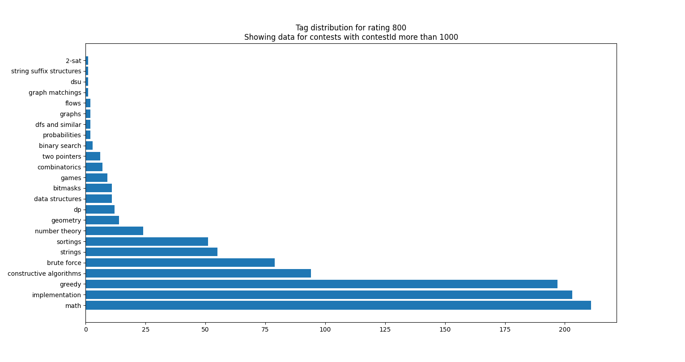
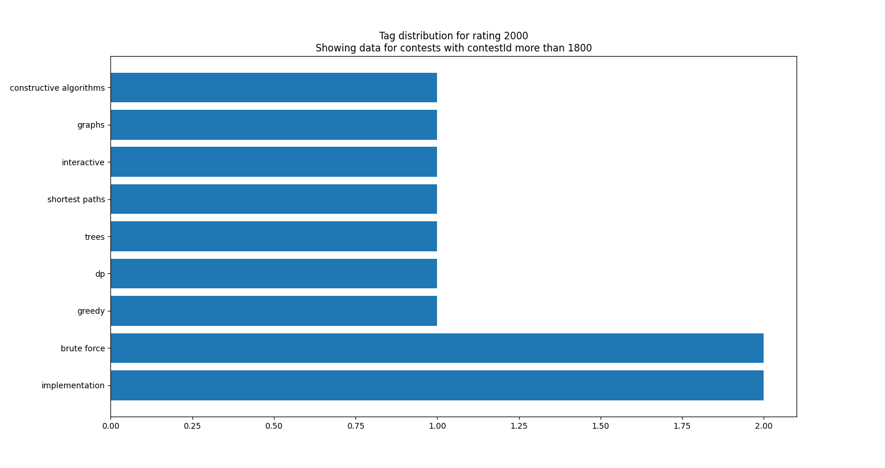

# cf-tags
A simple script to visualize the count of different tags in codeforces problems.
# Usage
Just run the main.py file! The program will try to download problemset data through the Codeforces API then stores it in a file. If you want to get the new data, just delete the file which the problems get written to (default is problems_file). Then enter the problem rating and minimum contest id separated with a space.\
You can find the contest id of a problem in its URL. For example, in the Watermelon problem, the URL is https://codeforces.com/problemset/problem/4/A. So the contest id would be 4. Or in https://codeforces.com/problemset/problem/1829/H, the contest id is 1829. If you want to see the tag distribution of the last 10 contest, open the latest problem in the problemset, the find its contest id, and if the contest id is say, 1860, enter 1750 so you would get the last 110 contests.
# Sample outputs
Output of `800 1000`:

Output of `2000 1800`:

